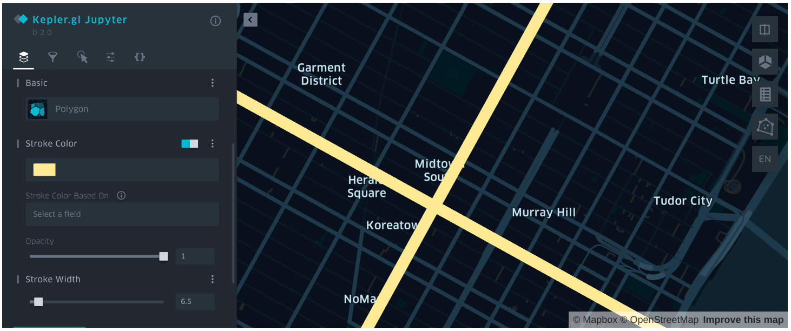

# Visualizing Spatiotemporal Information via Kepler.gl

[Kepler.gl](https://kepler.gl/) is a powerful open source web application for geospatial analytic visualizations. After importing Kepler.gl into Jupyter Notebook, you can get vivid and intuitive rendering of spatiotemporal data. This article shows how to use Kepler.gl to display the spatiotemporal information output by Arctern.

## Installing Jupyter Notebook and Kepler.gl

In the next sections, you need to use Jupyter Notebook for running Python codes and Kepler.Gl for visualizing spatial data. Run the commands below to install Jupyter and Kepler.Gl if you have not installed them yet:

```bash
# Enter the Conda environment
$ conda activate arctern_env

# Install Jupyter and Kepler.Gl
$ conda install -c conda-forge jupyterlab
$ pip install keplergl
```

## Loading Kepler.gl map

Use `KeplerGl` (see  [KeplerGl interface description](https://docs.kepler.gl/docs/keplergl-jupyter#1-load-keplergl-map)) to create a map object named `map_1`：

```python
# Load an empty map
from keplergl import KeplerGl
map_1 = KeplerGl()
map_1
```


## Adding data

Create two LINESTRING objects (`road1`, `road2`) to represent two roads, and save the geographic information of these roads in `df`. Then, use `add_data` (see [add_data interface description](https://docs.kepler.gl/docs/keplergl-jupyter#add_data)) to add  `df` as input dataset to the map.

```python
import pandas as pd

# DataFrame
df = pd.DataFrame({'geos': ['LINESTRING (-73.996324 40.753388, -73.972088 40.743215)', 'LINESTRING (-73.989555 40.741531, -73.973952 40.762962)']})
map_1.add_data(data=df, name='data_1')
map_1
```



Likewise, you can input data in CSV, GeoJSON and other formats to the map:

```python
# CSV
with open('csv-data.csv', 'r') as f:
    csvData = f.read()
map_1.add_data(data=csvData, name='data_2')

# GeoJSON
with open('sf_zip_geo.json', 'r') as f:
    geojson = f.read()

map_1.add_data(data=geojson, name='geojson')
```

## Reference

For more examples and interface descriptions, please refer to [the usage of Jupyter Notebook on Kepler.gl website](https://docs.kepler.gl/docs/keplergl-jupyter).