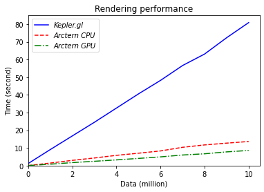

# How to visualize spatiotemporal data

Spatiotemporal data rendering is to display the overall appearance of data in a graphical way.

For example, in most navigation applications, the color of the road segment will change according to its congestion. Roads are marked in yellow at ordinary congestion levels and marked in red at severe congestion levels. Therefore, you can quickly understand the overall road congestion status in a geographical area according to the colors of roads, without falling into the specific details of specific data.

Currently, Arctern includes APIs commonly used in the [OGC](https://en.wikipedia.org/wiki/Open_Geospatial_Consortium) standard, including the constructor, accessor, relationship analysis, and measurement of geometric objects. Therefore, any third-party web rendering tool that accepts input in OGC standard format, such as [Kepler.gl](https://kepler.gl/), can be used by Arctern.

According to the [Kepler.gl User Guide](https://docs.kepler.gl/docs/user-guides), Kepler.gl accepts OGC standard [WKT](https://en.wikipedia.org/wiki/Well -known_text_representation_of_geometry) data as input. Therefore, you can use Arctern's `ST_AsText` method to convert spatiotemporal data from Arctern’s internal data format to WKT format, and then render the data via Kepler.gl.

Except for utilizing traditional web rendering tools to visualize graphical data, Arctern itself provides server-side rendering. Arctern supports the rendering of large-scale data in different types of maps, such as choropleth map, heat map, point map, icon map, and fishnet map. Also, Arctern's server-side rendering can take advantage of GPU acceleration to improve its performance.

## Comparison of rendering performance between Arctern and Kepler.gl

When processing different amount of data, the rendering times of Arctern (CPU and GPU version) and Kepler.gl are as follows:

| Amount of data  |   10 | 1e6 | 2e6 | 3e6 | 4e6 | 5e6 | 6e6 | 7e6 | 8e6 | 9e6 | 10e6 |
| --------------- | ---: | :------------: | :------------: | :------------: | :------------: | :------------: | :------------: | :------------: | :------------: | :------------: | :-------------: |
| **Kepler.gl**   | 1.23 |      9.11      |     16.82      |     24.53      |     32.56      |     40.58      |     48.22      |     56.62      |     63.13      |     72.36      |      80.92      |
| **Arctern CPU** | 0.05 |      1.45      |      2.98      |      4.32      |      5.81      |      7.02      |      8.31      |     10.36      |     11.71      |     12.72      |      13.65      |
| **Arctern GPU** | 0.05 |      0.81      |      1.71      |      2.45      |      3.24      |      4.08      |      4.94      |      6.00      |      6.69      |      7.77      |      8.59       |

> Time unit of data in the above table: second

Here is a line chart correspondent with the above data:

- The average rendering speed of Arctern CPU is 5.72 times faster than that of Kepler.gl.
- The average rendering speed of Arctern GPU is 9.84 times faster than that of Kepler.gl.

